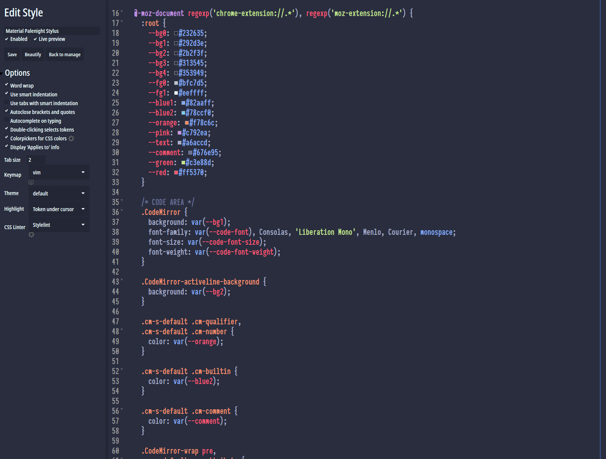

# Material Palenight Stylus

</img>

Preview of <i>Material Palenight Stylus</i>.

About
-------------------------------

<i>Material Palenight Stylus</i> is a user style for <i>Stylus</i>.

User styles are CSS code designed to alter the appearance of one, some, or all sites.

Instructions
-------------------------------

<strong>Step 1 : Install Stylus</strong> 

Depending of your browser.
+ for <a href="https://addons.mozilla.org/en-US/firefox/addon/styl-us/">Mozilla Firefox</a></li>
+ for <a href="https://chrome.google.com/webstore/detail/stylus/clngdbkpkpeebahjckkjfobafhncgmne?hl=en">Google Chrome</a>
+ for <a href="https://addons.opera.com/en-gb/extensions/details/stylus/?display=en">Opera</a>

<strong>Step 2 : Install the script </strong>
+ Directly with <b>Stylus</b> : <a href="https://raw.githubusercontent.com/Brettm12345/material-palenight-stylus/master/stylus.user.css">click here</a>

Report
-------------------------------

Don't hesitate to report any issues you find while using this userstyle.
